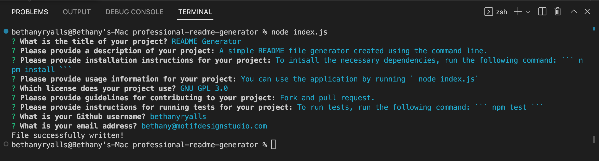

# Professional README Generator

## Description
A command-line application that dynamically generates a professional README.md file from a user's input using the Inquirer package.

The criteria for this project:
- When a user answers the prompt questions, they are displayed in the README.md under the correct section headings
- When a user chooses a license for their application from a list of options, a badge for that license is added near the top of the README.md and a notice is added to the section of the README entitled License
- When a user enters their GitHub username, it is added to the section of the README entitled Questions as a link to their GitHub profile
- When a user enters their email address, it's added to the section entitled Questions, with instructions on how to reach them
- When a user clicks on the links in the Table of Contents, they are taken to the corresponding section of the README.md

To view the video walkthrough, [please click this link.](https://drive.google.com/file/d/18gWyh2JXg2TPzVgPPVmJMVh4cnxfBeEA/view)

## Table of Contents
- [Installation/Usage](#installationusage)
- [Usage](#usage)
- [License](#license)
- [Technologies](#technologies)
- [Resources](#resources)
- [Walkthrough](#walkthrough)

## Installation/Usage

### Screenshot
The following screenshot shows the terminal with prompted Questions and given answers.

### The Generated README.md
- Navigate to the main page of the repository
- Open the 'README' folder
- Inside you'll find the generated README.md file

### Developers
1. Navigate to the main page of the repository
2. Click the green 'Code' button and copy the SSH or HTTPS key
3. In the terminal (Mac) or Git Bash (Windows) clone into the directory you want the repo in using the 'git clone' command followed by pasting your SSH or HTTPS key
4. Open the directory in your code editor
5. Inspect the index.js and generateMarkdown.js files to see how it works
6. To run, use the command: `node index.js`

## Technologies
- ES6
- Node.js
- Inquirer package

## Resources
- [Inquirer Package](https://www.npmjs.com/package/inquirer)

## Walkthrough
To view the video walkthrough, [please click this link.](https://drive.google.com/file/d/18gWyh2JXg2TPzVgPPVmJMVh4cnxfBeEA/view)